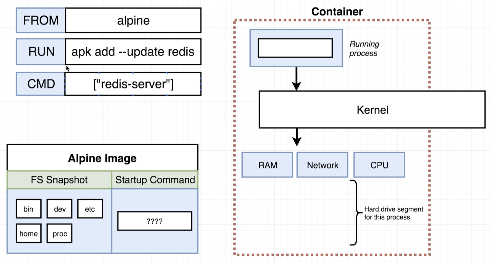

# Dockerfile

Until now, the course only showed how to use images that were already created. Now we will learn how build our own images.


The dockerfile will serve as a parameter to docker client that will redirect the commands to Docker server execute and generate a image based on the informed commands


The usual flow for a Docker file consists in informing a base image, run commands to install additional programs and then inform the commands that will execute the application as a whole. In the example below:

- Alpine was used as a bage image. Alpine is a minimal linux based image.
- A command to install redis was selected
- The command to run redis was informed inside the CMD command, this command will be executed on container startup

```
# Uses existing docker image as a base
FROM alpine

# Download and install dependencies
RUN apk add --update redis

# Tell the image what to do when it starts as a container
CMD ["redis-server"]
```

Observation: The difference between RUN and CMD is that RUN specifies commands that must be executed in order to create de image and CMD specifies the commands that will run when the container starts

# What is an base image

When you receive a dockerfile, that is the same as receiving a empty computer with nothing installed on it


And when we do receive such a empty computer, we want to execute a set of tasks that will prepare the computer to be able to execute some kind of purpose. Let's say we want a computer that is able to navigate on google chrome. So, the steps we must execute on our empty computer are as follows:


If those commands were executed by a Dockerfile, it would look like:


Because the base image works like a operating system and the installation steps are like the preparations needed on the docker file RUN command. At last, the CMD command will run the program as it's already installed.


## Why did we use alpine?

We used alpine for the same reason we use an operating system, to use their preinstalled funcionalities, programs, etc. In our example file we have the line:

> RUN apk add --update redis

The apk command belongs to alpine and is a package manager. So the reason we were capable of installing redis in a single line was due to alpine preconfigured functionaly.


# The build process in detail

Now we need to understand what happens when the Dockerfile is built. First of all let's say we have a setup like:



We have a dockerfile our system. We know that our alpine image has a base file system like is shown in the picture. What happens now is that when we load the base image, a TEMPORARY container is created and loads the image file system to the hard drive segment that was created and asigned to the created container. After that, the process "apk add --update redis" is run and let's say it creates a folder called redis on the file system. The result is as follows:


Then docker stops the TEMPORARY container and takes a FILE SYSTEM SNAPSHOT of this container and turns it into a image with a id. In our example, let's say the image id was: 38ec9aea7e10. Now, what was previously a base alpine image, now turns into a 38ec9aea7e10 that has redis installed. Something like:


The image above is the end result of step number two:

> RUN apt add --update redis

For the last step, the image created in step number two is used on step number three, which defines a running commmand for the created image. So, once again the file system is copied to a new container and a command is selected for it:


The difference is that now the redis-server command is not executed, it just says "listen, when a container is executed by using this image, the first command to be run should be 'redis-server'". Now, a new image is created by the snapshot of this container, let's say it's id is: fc60771eaa08


```
FROM alpine

RUN apk add --update redis

CMD ["redis-server"]
```

Now we understand that for each line of command in a Dockerfile, a temporary container is created, the selected command is executed and it new state (commands + filesystem) is used to create a image that will be used as input to the next command, until the last command that will generate the file image for the Dockerfile.