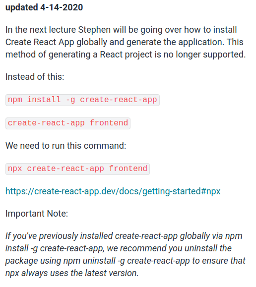
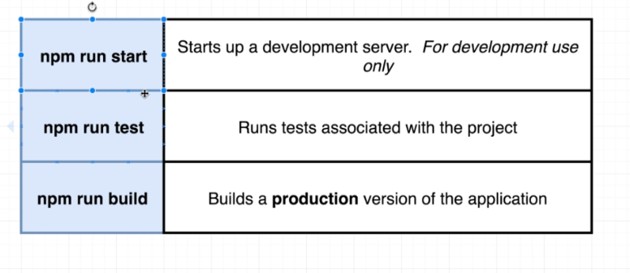
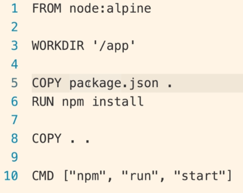
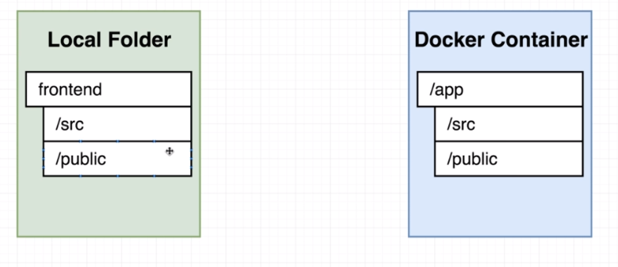
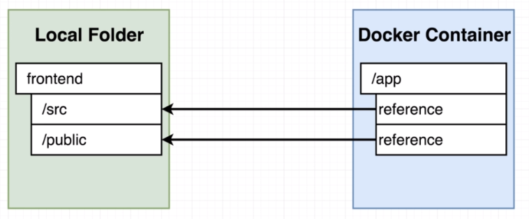
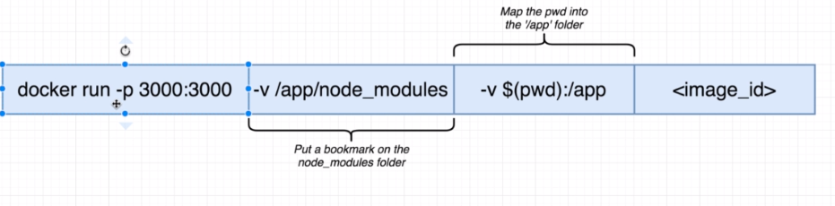

In this section, we're going to create a production like react application using docker. To do so, we will go through the basic development steps, which are: code dev, testing and deployment.

## Flow specifics

He talks about creating a feature branch and then merging into master branch, we already know how to do that. The thing is, once we merge the code into the master branch, we will activate a CI mechanism, which in our case will be Travis CI. Travis will then run ou tests suite and then deploy our code into the aws hosting.

## Docker's purpose

In the entire flow of development, docker is not cited, and that's because docker is not a fundamental development tool, it's going to make our life easier in multiple steps but in the end of the day we could execute all those steps without using docker.

## Creating react application

The image below was taken from the course page and helps intalling the react application

## Necessary commands

You can at the start run

> npm run test

And that will show you that you project is actually working. Then, you can run

> npm run start

It will run you project and it's going to be possible to see the react default page

> npm run build

This will generate in your project folder a "build" folder, which are you project files. In the folder /static/js it's going to be possible to see a js file that starts with main. That is basically the file of the application that will actually contain its code and also is generally the file that will be deployed to our AWS service.

## Creating the Dev Dockerfile

So, there is 2 situations that the project will run. In development and in production. In this section the dockefile for development is going to be generated and is going to be called Dockerfile.dev (in the future, the production file will be simply called "Dockerfile".

> Dockerfile.dev

It's pretty similar to the previous section so we're not going to talk a lot about it. The thing is: since it's not called "Dockerfile" the default "docker build" command will not identify the file because it doesn't have its default name ("Dockerfile"). So we need reference it in the command

> docker build -f Dockerfile.dev .

## Duplicating dependencies

If you have the following message on your docker build

> Sending build context to Docker daemon xxx Mb

It means you're sending unecessary files to your containers. In this case, you just have to delete node_modules folder

## React App Exits Immediately with Docker Run Command

> docker run -it -p 3000:3000 CONTAINER_ID

## Starting container

Problem now is that right now if we make a modification in our react project it will not be reflected on our running application. Because our files are taken as a snapshot to the container, so we can't modify them. To go around that we will need next section

## Docker Volumes

The default behavior when you execute the container like we did before is: a copy of the files is sent to the container and they no longer have a direct relation to the original files

If we use docker volumes, we can say to the container that some files are in fact in the system files, so there is a reference to the files and not copies in the container. In this case, when we modify the files in our development environment, it will reflect on our container.

In the end, we have the folling command. A important thing is the pwd command. That command stands for "Present working directory" and will print the path to folder the terminal is executing on at the moment. So, when we specify -v $(pwd):/app we will say to docker that the files in this directory will be the actual files that the container will use and the files within it are only references to the original ones.

If we execute only

> docker run -p 3000:3000 -v $(pwd):/app container_id

it will show an error ("sh: react-scripts: not found") and that is related to the missing parameters and the next section

## Bookmarking Volumes

The problem described is really simple. Our command told docker to map our "pwd" folder files to the container app file. Problem is: we do not have node_modules anymore, do we? So the behavior is like:

 
When we bookmark a certain folder, we are telling docker to make an exception to this folder and to not use a reference on it, instead it will use the actual folder that it will generate on its own.

> docker run -p 3000:3000 -v /app/node_modules -v $(pwd):/app image_id
