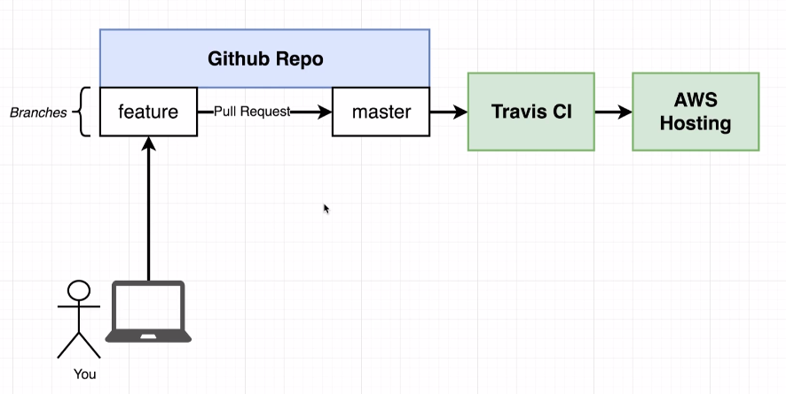
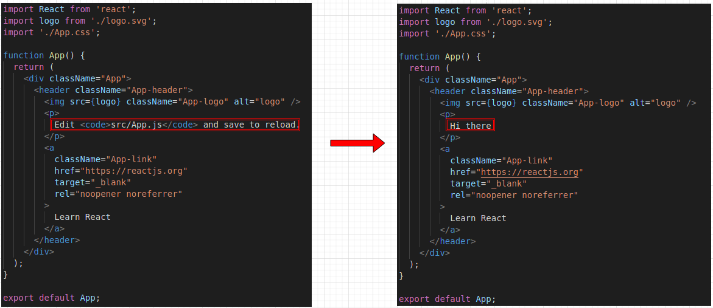
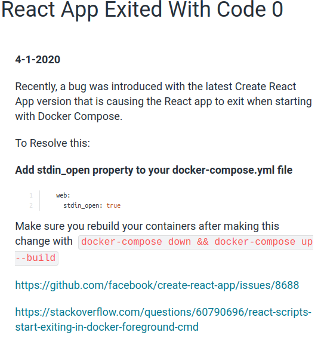

In this section, we're going to create a production like react application using docker. To do so, we will go through the basic development steps, which are: code dev, testing and deployment.


# Flow specifics

He talks about creating a feature branch and then merging into master branch, we already know how to do that. The thing is, once we merge the code into the master branch, we will activate a CI mechanism, which in our case will be Travis CI. Travis will then run ou tests suite and then deploy our code into the aws hosting.



# Docker's purpose

In the entire flow of development, docker is not cited, and that's because docker is not a fundamental development tool, it's going to make our life easier in multiple steps but in the end of the day we could execute all those steps without using docker.

# Creating react application

The image below was taken from the course page and helps intalling the react application


* It's important to have nvm installed on your computer. The version used in this course was node v14.5.0
```
npm install -g create-react-app

npx create-react-app frontend
```

# Necessary commands


You can at the start run

> npm run test

And that will show you that you project is actually working. Then, you can run

> npm run start

It will run you project and it's going to be possible to see the react default page

> npm run build

This will generate in your project folder a "build" folder, which are you project files. In the folder /static/js it's going to be possible to see a js file that starts with main. That is basically the file of the application that will actually contain its code and also is generally the file that will be deployed to our AWS service.

# Creating the Dev Dockerfile

So, there is 2 situations that the project will run. In development and in production. In this section the dockefile for development is going to be generated and is going to be called Dockerfile.dev (in the future, the production file will be simply called "Dockerfile".

> Dockerfile.dev


```Dockerfile
FROM node:alpine

WORKDIR '/app'

COPY package.json .
RUN npm install

COPY . .

CMD ["npm", "run", "start"]
```

It's pretty similar to the previous section so we're not going to talk a lot about it. The thing is: since it's not called "Dockerfile" the default "docker build" command will not identify the file because it doesn't have its default name ("Dockerfile"). So we need reference it in the command

> docker build -f Dockerfile.dev .

# Duplicating dependencies

If you have the following message on your docker build

> Sending build context to Docker daemon xxx Mb

It means you're sending unecessary files to your containers. In this case, you just have to delete node_modules folder in your working directory, because the container has already a copy of it since it's already run the npm install internally

# React App Exits Immediately with Docker Run Command

> docker run -it -p 3000:3000 CONTAINER_ID

# Starting container

Problem now is: imagine you want to modify something in your react project. Let's say something as shown below:



 Our modification will not be reflected on our running application. Because our files are taken as a snapshot to the container, so we can't modify them. To go around that we will need next section

# Docker Volumes

The default behavior when you execute the container like we did before is: a copy of the files is sent to the container and they no longer have a direct relation to the original files


If we use docker volumes, we can say to the container that some files are in fact in the system files, so there is a reference to the files and not copies in the container. In this case, when we modify the files in our development environment, it will reflect on our container.


In the end, we have the folling command. A important thing is the pwd command. That command stands for "Present working directory" and will print the path to folder the terminal is executing on at the moment. So, when we specify -v $(pwd):/app we will say to docker that the files in this directory will be the actual files that the container will use and the files within it are only references to the original ones.


If we execute only

> docker run -it -p 3000:3000 -v "$(pwd)":/app container_id

it will show an error ("sh: react-scripts: not found") and that is related to the missing parameters and the next section

# Bookmarking Volumes

The problem described is really simple. Our command told docker to map our "pwd" folder files to the container app file. Problem is: we do not have node_modules anymore, do we? So the behavior is like:


 
When we bookmark a certain folder, we are telling docker to make an exception to this folder and to not use a reference on it, instead it will use the actual folder that it will generate on its own.

> docker run -it -p 3000:3000 -v /app/node_modules -v "$(pwd)":/app container_id

# React exited with code 0

<details><summary>Read more...</summary>


```yaml
  web:
    stdin_open: true
```

> docker-compose down && docker-compose up --build

https://github.com/facebook/create-react-app/issues/8688

https://stackoverflow.com/questions/60790696/react-scripts-start-exiting-in-docker-foreground-cmd
</details>

# Shorthand with docker compose

> docker run -it -p 3000:3000 -v /app/node_modules -v "$(pwd)":/app container_id

It's a pretty big command, isn't it? Good thing is: Docker compose was a feature made to simplify "docker run". So now we're using it:

docker-compose.yml
```yaml
version: '3'
services:
  web: # Name of the service, could have been any string
    build: . #lets see if there is a problem even if we do not have a default named Dockerfile
    ports:
      - 3000:3000
    volumes:
      - /app/node_modules 
      - .:/app # the dot represents the actual running folder. So it will consider the docker run will be executed on "frontend" folder   
```

So we will try:

> docker-compose up

ANNNNNNNNNNNNND... It fails:

```
Creating network "frontend_default" with the default driver
Building web
ERROR: Cannot locate specified Dockerfile: Dockerfile
```
So... How do we fix it?

# Overriding Dockerfile Selection

It's pretty simple. Our previous docker-compose file had the build property as follows:

```yaml
version: '3'
services:
  web:
    build: .
```

We need to tell it, that in reality our context is indeed our actual folder (represented by the character dot '.'),
however our dockerfile hasn't its default name. So we end up with:

```yaml
version: '3'
services:
  web: 
    build:
      context: .
      dockerfile: Dockerfile.dev
    ports:
      - 3000:3000
    volumes:
      - /app/node_modules 
      - .:/app # the dot represents the actual running folder. So it will consider the docker run will be executed on "frontend" folder   
```

And voila! It should work now

# Do we still need the copy command in dockerfile

```Dockerfile
FROM node:alpine

WORKDIR '/app'

COPY package.json .
RUN npm install

COPY . . # not necessary in development

CMD ["npm", "run", "start"]
```

We don't, but we should leave it there. Let's recap. Our copy command will send all our files to the container, later on we map the container and tell it to reference our development files instead. So, why copy the files in the first place? That's correct, but that is only truth because we're using docker compose.
If we decide to stop using it, the command will be once again necesary. Another instance where it's recommended to leave it there is to use the Dockerfile.dev
as a model to our production Dockerfile, which will also need the copy command.

