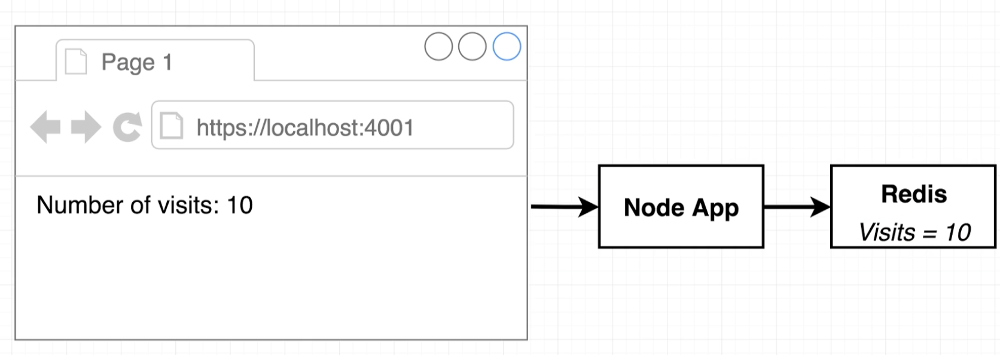
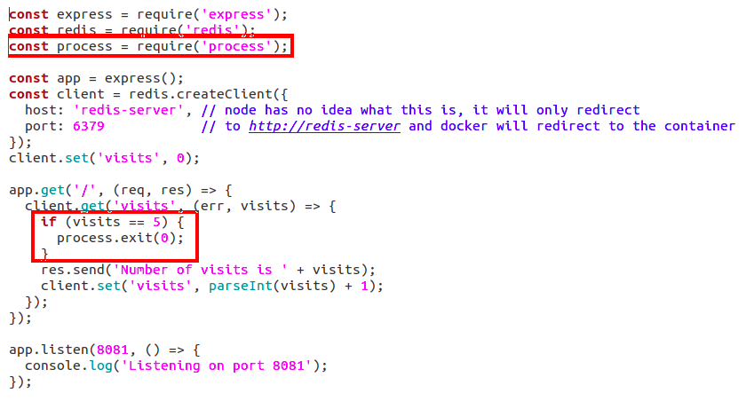
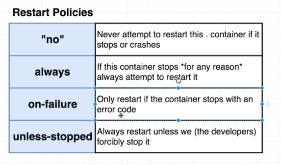
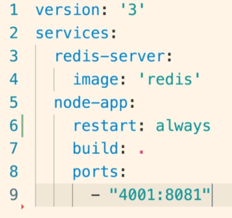

# Docker Compose

In this section we'll work on a simple node application that counts how many times it's endpoint has been accessed. To do so we're going to need a simple application and a database (redis), so we can exercise docker compose



# Introduction

So.. what if I want to run 2 containers that will interact with each other, such as: nodeJs and redis. What can I do? Can I start both containers separately and have them interacting via HTTP? Absolutely. The problem is, the applications will not be able to "see one another", because they are working on different containers with different networks.

We can configure the network for them. In this case, they will be able to "see each other" and then work together. The problem is that to do so you have to deal with a bunch of configuration. ORRR use docker compose!

Docker-compose is a command that embeddeds a bunch o  configuration for running multiple containers. It creates the network between the containers and starts them all simultaneosly.

# docker-compose.yml

```
version: '3'
services:
  redis-server:
    image: 'redis'
  node-app:
    build: .
    ports:
      - "4001:8081" 
```

In the docker compose above we can see a redis server being started and a nodeJs application (inside a container with Dockerfile) being started. "services" represent the containers, which have its names. Redis-server is the container resulted from the execution of redis image, and the node-app container is the result of the execution of the command build for the local folder location (represented by ".")

# Exection

To execute the docker compose, you have to use the commands

> docker-compose up --build

which works the same as

> docker build . & docker run myimage

If you only run docker-compose up, it's not going to rebuild the images. So if you have any modification that requires nodeJs to be rebuilt (like a new dependency or modifying a controller) it will necessary to add "--build" at the end of the command. 

# Other useful commands

> docker-compose up -d

Starts containers in background, without the terminal listening to them.

> docker-compose down

Stops all docker-compose running commands

# Network, Maintenance and Restart Policies

We added some lines to our nodeJs controller, which were those two blocks:

```
host: 'redis-server',
port: 6379
```

```
const process = require('process');

if (visits == 5) {
  process.exit(0);
}
```



- The first block configures the network between node-app and redis, by defining redis-server as the host (instead of a database url) we're telling the node app to use docker compose's alias 'redis-server' that will redirect to the redis container. So that's it for network

- The second block stops the nodejs server with status error 0. Thats important. But firstly, lets talk about the restart policies existent:



Those policies means whether or not docker should try to restart containers when they get terminated for some reason. The default value is "no", so if your containers runs out, docker will not try to restart it. The second possbile type is 'always' and thats quite the opposite of the first, whenever a container with this type of restart crashes, docker will try to run it again. To do so, you do the following configuration:



The third option has a tiny rule, if your exit error code returns zero, it will not try to restart the container. And that's because the exit error code 0 means the application was stopped due to a rule that does not mean a unknown error, it was on purpose. Any other code returned, 1 to 1000, will trigger container restart. And the last one is that the container can only be stopped by command line (?)

# Final docker-compose.yml

```
version: '3'
services:
  redis-server:
    image: 'redis'
  node-app:
    restart: 'no' # has to be put in quotes because 'no'is reserved for yaml
    build: .
    ports:
      - "4001:8081" 
```

## docker-compose ps

It will show all containers running from your docker-compose file. So it needs to be run on the folder which contains your docker-compose.yml file, otherwise it will launch and error.