In this section, we're going to create a production like react application using docker. To do so, we will go through the basic development steps, which are: code dev, testing and deployment.


# Flow specifics

He talks about creating a feature branch and then merging into master branch, we already know how to do that. The thing is, once we merge the code into the master branch, we will activate a CI mechanism, which in our case will be Travis CI. Travis will then run ou tests suite and then deploy our code into the aws hosting.

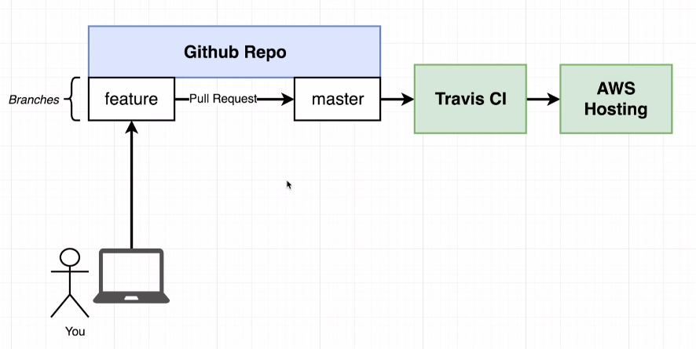

# Docker's purpose

In the entire flow of development, docker is not cited, and that's because docker is not a fundamental development tool, it's going to make our life easier in multiple steps but in the end of the day we could execute all those steps without using docker.

# Creating react application

The image below was taken from the course page and helps intalling the react application


* It's important to have nvm installed on your computer. The version used in this course was node v14.5.0
```
npm install -g create-react-app

npx create-react-app frontend
```

# Necessary commands


You can at the start run

> npm run test

And that will show you that you project is actually working. Then, you can run

> npm run start

It will run you project and it's going to be possible to see the react default page

> npm run build

This will generate in your project folder a "build" folder, which are you project files. In the folder /static/js it's going to be possible to see a js file that starts with main. That is basically the file of the application that will actually contain its code and also is generally the file that will be deployed to our AWS service.

# Creating the Dev Dockerfile

So, there is 2 situations that the project will run. In development and in production. In this section the dockefile for development is going to be generated and is going to be called Dockerfile.dev (in the future, the production file will be simply called "Dockerfile".

> Dockerfile.dev

```Dockerfile
FROM node:alpine

WORKDIR '/app'

COPY package.json .
RUN npm install

COPY . .

CMD ["npm", "run", "start"]
```

It's pretty similar to the previous section so we're not going to talk a lot about it. The thing is: since it's not called "Dockerfile" the default "docker build" command will not identify the file because it doesn't have its default name ("Dockerfile"). So we need reference it in the command

> docker build -f Dockerfile.dev .

# Duplicating dependencies

If you have the following message on your docker build

> Sending build context to Docker daemon xxx Mb

It means you're sending unecessary files to your containers. In this case, you just have to delete node_modules folder in your working directory, because the cached container has already a copy of it since it's already run the npm install internally

# React App Exits Immediately with Docker Run Command

> docker run -p 3000:3000 CONTAINER_ID

or

> docker run -it -p 3000:3000 CONTAINER_ID

The difference in commands depends on the version of node/create-react-app version

Obs: In linux, second command was necessary, on macos the needed command was the first one
# Starting container

Problem now is: imagine you want to modify something in your react project. Let's say something as shown below:

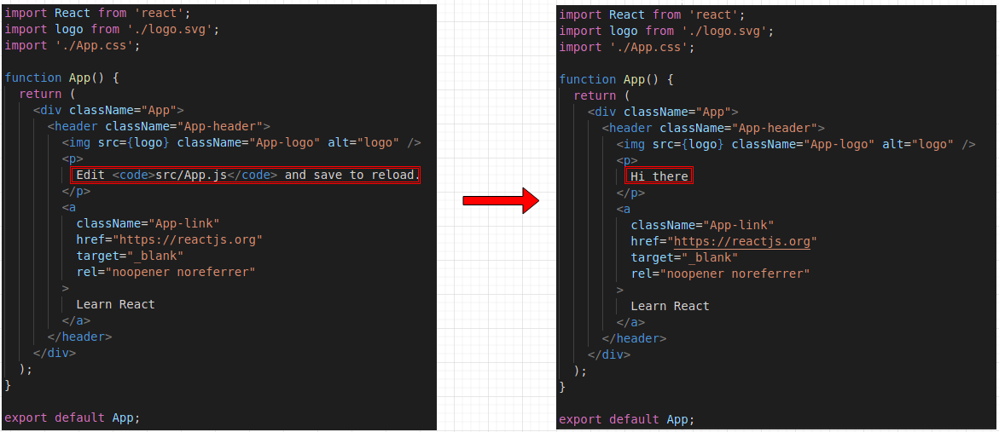

 Our modification will not be reflected on our running application. Because our files are taken as a snapshot to the container, so we can't modify them. To go around that we will need next section

# Docker Volumes

The default behavior when you execute the container like we did before is: a copy of the files is sent to the container and they no longer have a direct relation to the original files

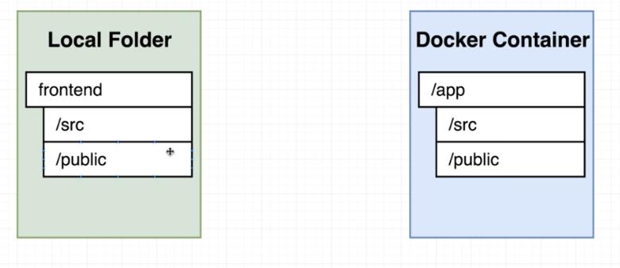

If we use docker volumes, we can say to the container that some files are in fact in the system files, so there is a reference to the files and not copies in the container. In this case, when we modify the files in our development environment, it will reflect on our container.


In the end, we have the following command. A important thing is the pwd command. That command stands for "Present working directory" and will print the path to folder the terminal is executing on at the moment. So, when we specify -v $(pwd):/app we will say to docker that the files in this directory will be the actual files that the container will use and the files within it are only references to the original ones.


If we execute only

> docker run -it -p 3000:3000 -v "$(pwd)":/app container_id

it will show an error ("sh: react-scripts: not found") and that is related to the missing parameters and the next section

# Bookmarking Volumes

The problem described is really simple. Our command told docker to map our "pwd" folder files to the container app file. Problem is: we do not have node_modules anymore, do we? So the behavior is like:

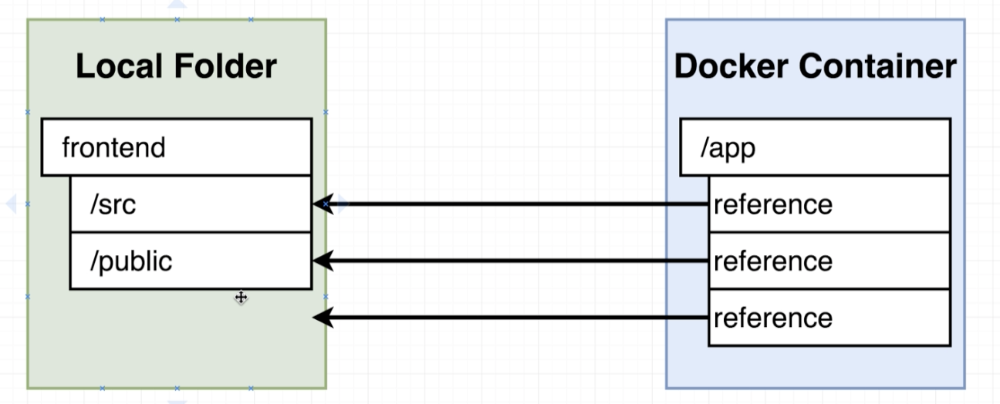

To avoid that, we're going to need to bookmark our node_modules folder inside the container:


 
When we bookmark a certain folder, we are telling docker to make an exception to this folder and to not use a reference on it, instead it will use the actual folder that it will generate on its own.

> docker run -it -p 3000:3000 -v /app/node_modules -v "$(pwd)":/app container_id

Now if we make a change on our development folder, we get instant change on the running application hosted by the container:


# React exited with code 0

<details><summary>Read more...</summary>


```yaml
  web:
    stdin_open: true
```

> docker-compose down && docker-compose up --build

https://github.com/facebook/create-react-app/issues/8688

https://stackoverflow.com/questions/60790696/react-scripts-start-exiting-in-docker-foreground-cmd
</details>

# Shorthand with docker compose

> docker run -it -p 3000:3000 -v /app/node_modules -v "$(pwd)":/app container_id

It's a pretty big command, isn't it? Good thing is: Docker compose was a feature made to simplify "docker run". So now we're using it:

docker-compose.yml
```yaml
version: '3'
services:
  web: # Name of the service, could have been any string
    build: . #lets see if there is a problem even if we do not have a default named Dockerfile
    ports:
      - 3000:3000
    volumes:
      - /app/node_modules 
      - .:/app # the dot represents the actual running folder. So it will consider the docker run will be executed on "frontend" folder   
```

So we will try:

> docker-compose up

ANNNNNNNNNNNNND... It fails:

```
Creating network "frontend_default" with the default driver
Building web
ERROR: Cannot locate specified Dockerfile: Dockerfile
```
So... How do we fix it?

# Overriding Dockerfile Selection

It's pretty simple. Our previous docker-compose file had the build property as follows:

```yaml
version: '3'
services:
  web:
    build: .
```

We need to tell it, that in reality our context is indeed our actual folder (represented by the character dot '.'),
however our dockerfile hasn't its default name. So we end up with:

```yaml
version: '3'
services:
  web: 
    build:
      context: .
      dockerfile: Dockerfile.dev
    ports:
      - 3000:3000
    volumes:
      - /app/node_modules 
      - .:/app # the dot represents the actual running folder. So it will consider the docker run will be executed on "frontend" folder   
```

And voila! It should work now

# Do we still need the copy command in dockerfile

```Dockerfile
FROM node:alpine

WORKDIR '/app'

COPY package.json .
RUN npm install

COPY . . # not necessary in development

CMD ["npm", "run", "start"]
```

We don't, but we should leave it there. Let's recap. Our copy command will send all our files to the container, later on we map the container and tell it to reference our development files instead. So, why copy the files in the first place? That's correct, but that is only truth because we're using docker compose (and using docker volumes in it or as a parameter to normal docker build execution).
If we decide to stop using it, the command will be once again necesary. Another instance where it's recommended to leave it there is to use the Dockerfile.dev
as a model to our production (or homologation) Dockerfile, which will also need the copy command.

# Executing tests

Now, let's learn how to run tests on our development environment

>  docker build -f Dockerfile.dev .

And then, instead of running:

> docker run container_id

We will run:

> docker run container_id npm run test


Now, that still is not the optimal interface to interact with tests execution, remember that if we want to interact with the container we need to use the it flag, so:

> docker run -it container_id npm run test

It will give us a way more full screen experience:


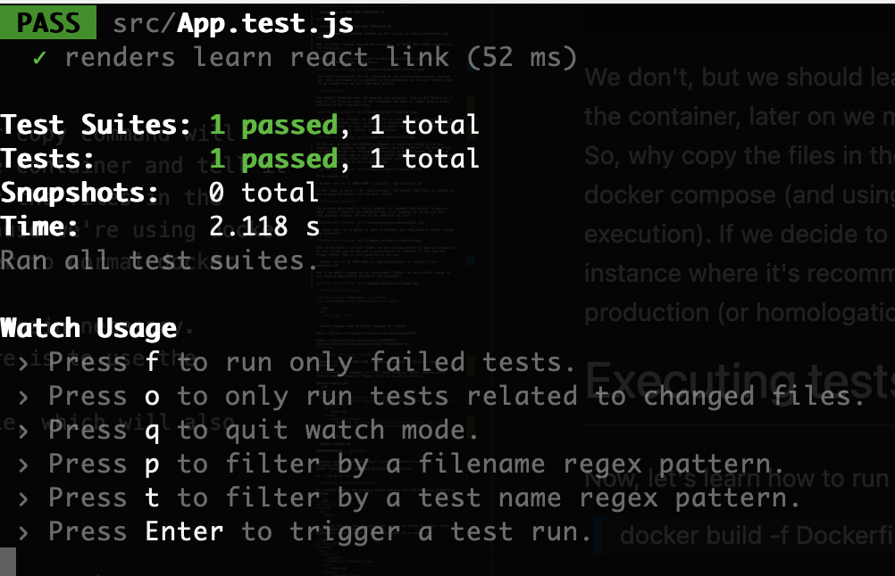


# Live updating tests (First method)


Cool, so we can run our tests inside our container. But... If we change our tests, does it reflect on the execution inside the container? No.. To solve this we could use once again docker compose and create a second "service" which would map the tests as volumes, that would totally work. But there's a more interesting approach to it.

We can execute our container normally with:

> docker-compose up

Open a new terminal window, get the container id with docker ps and execute:

> docker exec -it container_id npm run test

It will create an interaction with the running container which will run the test and will even detect changes on our test files. To see that happening, just duplicate the existing test on App.test.js:

# Docker compose for running tests (Live updating tests Second method)

Now, another way to run our test in a live manner is defining a second service in our docker compose, which will create a container that will only run our tests.

```yaml
version: '3'
services:
  web: 
    build:
      context: .
      dockerfile: Dockerfile.dev
    ports:
      - 3000:3000
    volumes:
      - /app/node_modules 
      - .:/app
  tests:
     build:
      context: .
      dockerfile: Dockerfile.dev
    volumes:
      - /app/node_modules 
      - .:/app
    command: ["npm", "run", "test"]
```

To run it:

> docker-compose up --build

The build flag was used because we added a new service in our docker-compose file it can cause some errors if we don't build it. 


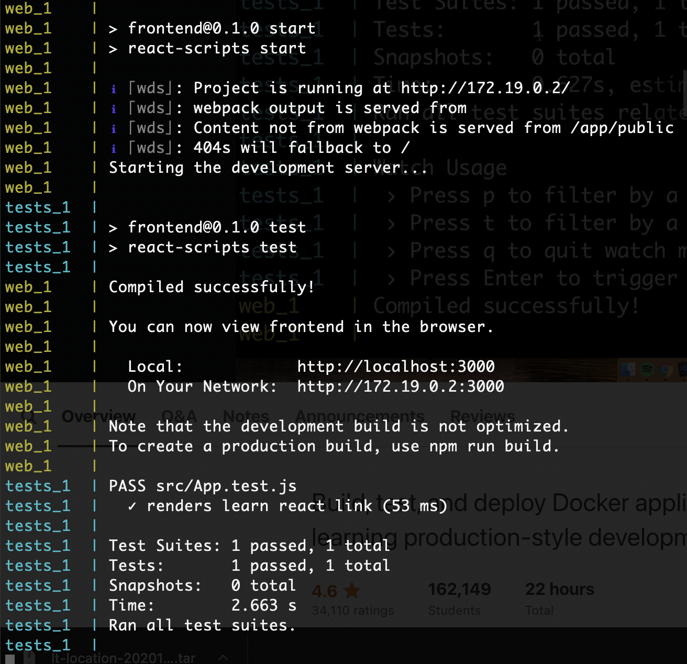

# Shortcomings on tests (Docker Attach)

As we can see, both containers were started but we can't interact with none of them, that's because our terminal isn't connected to their stdin/stdout by default, se we need to do it.


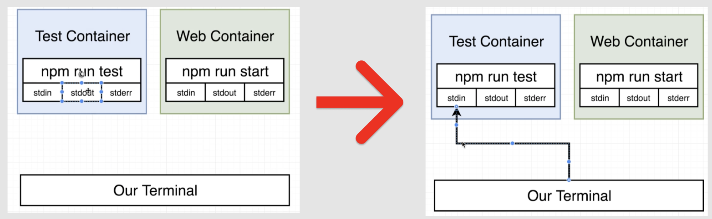

In order to connect to the running container, we can use "docker attach". So, run:

> docker ps

> docker attach test_container_id

And the result is 

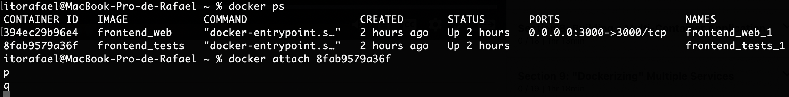

IT FAILS. Unfortunately by using docker compose the result we had previously mixed with the web service is as good as it gets. And that's because when we run the docker run tests inside the container, we do not create a process for it directly, we create a npm process that creates the process that actually executes the tests, so our problem is that we need to connect to the stdin of the test process and not npm and when we use docker attach it connects to the primary command that was started in container. So what's happening and what we need to happen is represented below:

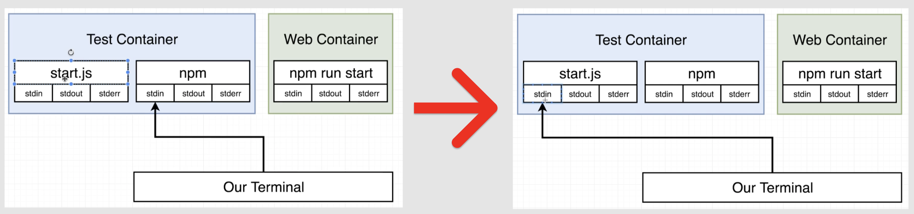

Unfortunately the author didn't show any way of actually doing that mainly because it seems rather difficult to do so.

# Need for nginx

Now, let's learn how to use npm run build to create our production environment.

> npm run build

Until now, we have been using our application in the following manner:

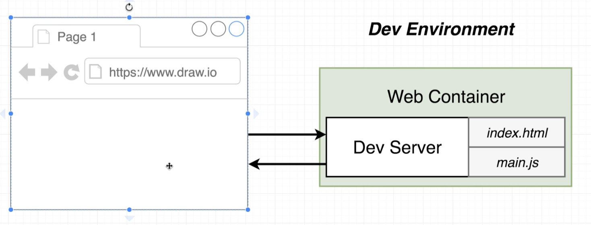

We had a development server that handled all our changes to the code and modified our main.js and our index.html to respond accordingly. That is not the case for the production environment since we won't be making changes on it directly. So the next way our application should work is:

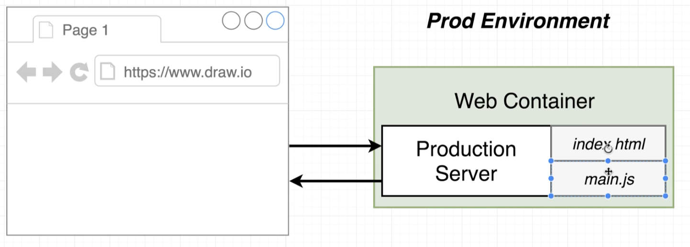

The production server is way more light than the development one mainly because we don't need the changes. So, now we need a web server that is light and simple, that will simply redirect requests to our resources, and for that there is Nginx:

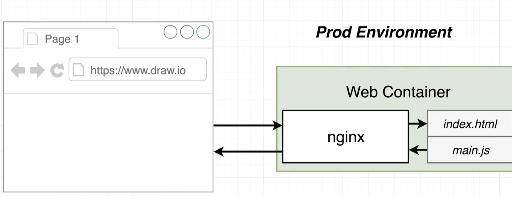

Nginx is a extremely simple web server that will redirect http calls to our resources, it's a configuration base web server.

# Multi-step docker build

So, now we want to use nginx right? We're going to need a new set of commands different from those of Dockerfile.dev. So we can think of a workflow:

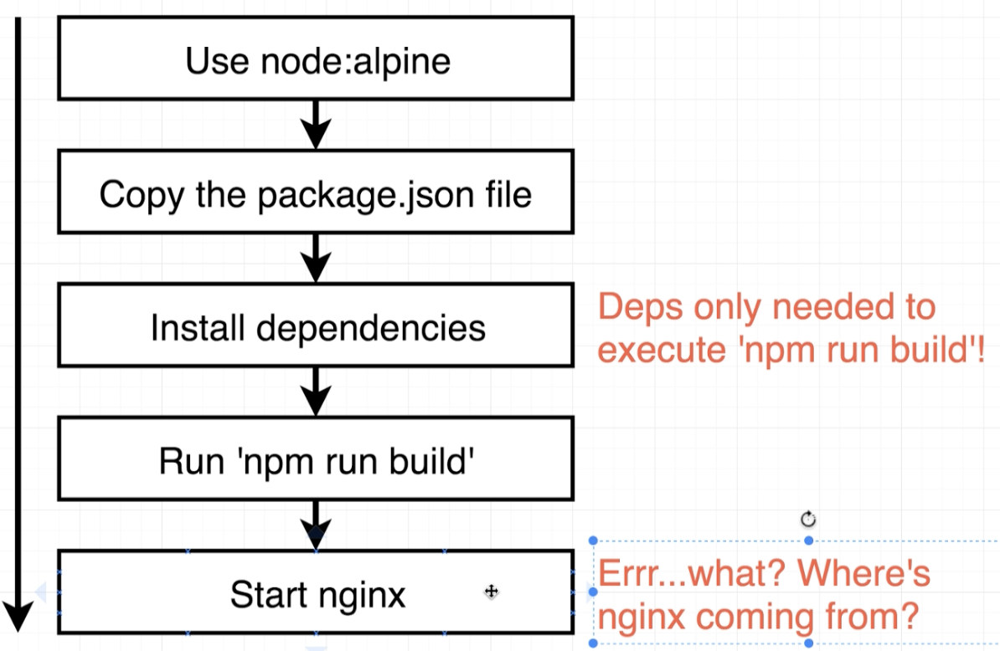

But there are some points that we need to cover. We don't really need a loot of folders inside our project, because docker run build summarizes everything in a single "build" folder and that's the only folder we're going to need.

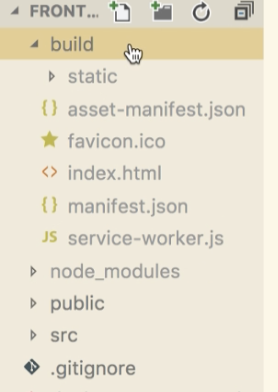

The second point is that we're already using an base image that contains node.js to run our application, so how we're going to install nginx since we going to need its base image also? That's where multi-step build process comes in  hand. Our cockerfile's going to use two base images. And that's how:

First we going to choose a nginx image:

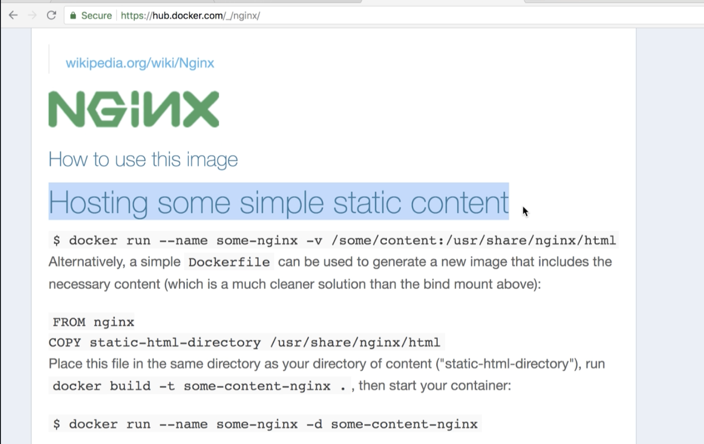

And then we're going to alter ou dockerfile to do the following:

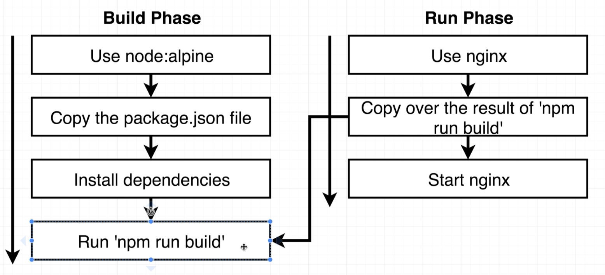

Part of our dockerfile will use nodejs to create our build folder and the second part will install our nginx using it's image as a base. In order to all of this to work, the second part will copy the result of the first one. This way our build process will be able to use both base images.

# Implementing multi-step

```Dockerfile
FROM node:alpine as builder #naming the whole block
WORKDIR '/app'
COPY package.json .
RUN npm install
COPY . . #no need for volumes, since no changes will be made
RUN npm run build
 
FROM nginx
COPY --from=builder /app/build /usr/share/nginx/html #moving to nginx main folder

#there's no need for a CMD to start nginx because its image already starts it as default
```

WARNING: AWS Doesn't accept naming. So the dockerfile should be:

```Dockerfile
FROM node:alpine
WORKDIR '/app'
COPY package.json .
RUN npm install
COPY . .
RUN npm run build
 
FROM nginx
COPY --from=0 /app/build /usr/share/nginx/html
```

# Running nginx

> docker build .

> docker run -p 8080:80 container_id