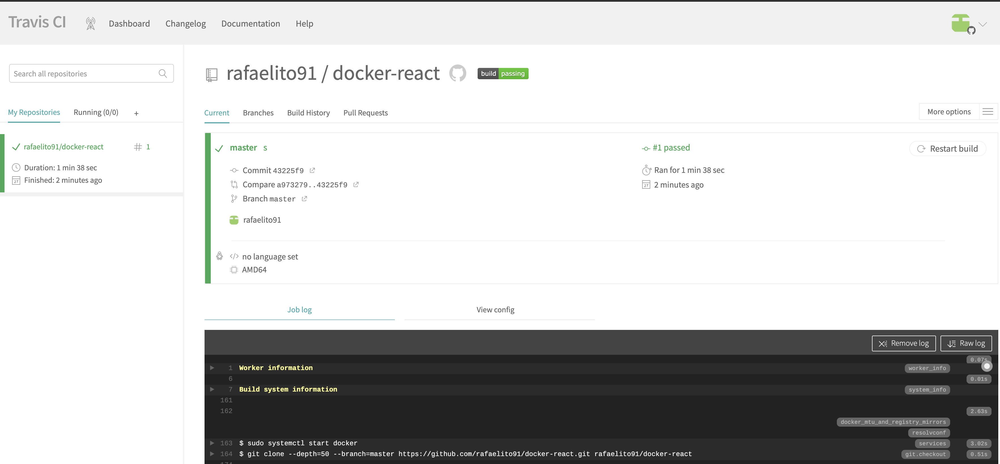
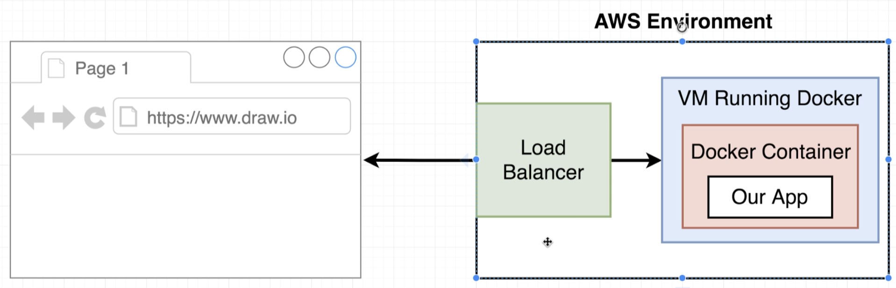

# Intro

Now we will implement our dev flow


Travis CI will execute tests and deploy of the application

# Github

https://github.com/rafaelito91/docker-react

# Travis CI

Go to http://travis-ci.com and:
- Login with your github account
- Go to profile
- Look for the list of repositories, search for the repo e click the switch

Good, now we told travis to, everytime the codebase is updated, it should download it and make something with it. Now we can see our docker-react project on the main page

# Travis YML File Configuraiton

Add .travis.yml to the root of the project


```yaml
sudo: required #to use docker we need superuser
services:
  - docker #tells travis it needs to install docker on the machine our pipeline will run

before_install: #steps that need to occur before our commands
  - docker build -t rafaelito91/docker-react -f Dockerfile.dev .
```

# A touch more travis setup

```yaml
sudo: required
services:
  - docker

before_install:
  - docker build -t rafaelito91/docker-react -f Dockerfile.dev .

script:
  - docker run rafaelito91/docker-react npm run test -- --coverage # the 2 final arguments were necessary for the react test do not stop on that dashboard waiting for input, otherwise travis won't understand that the tests were over
```

Observation: Instead of used script, use this because the create-react-app changed

```yaml
language: generic 
script:
  - docker run -e CI=true rafaelito91/docker-react npm run test
```

# Automatic build creation

> Now commit

Commiting those changes will trigger travis CI and it will build the project



# AWS Elastic beanstalk

Now we need somewhere to deploy our application and the chosen place is: aws elastic beanstalk which is one of the easiest platforms to upload single applications.

Follow the steps:
- Go to aws.amazon.com
- Create account (need credit card)
- Login
- Go to elastic beanstalk
- Create application with platform "docker" it already creates an environment
- Create environment (Web application env, not worker) if the previous step didn't

Now click your environment and voila, there you have it


Good. So let's understand what we want to do.



When some user (us in this case) make a request to our application, it will first go through aws Load balancer, which will redirect the call to a aws VM running our docker container which contains our application. That's pretty much it. If the request number increases too much, elastic beanstalk automatically will increase the number of machines and make its load balancer route between them as it seems fit:


To see this structure URL you need to look at our environment page and look for something like:


```
http://dockerreact-env.eba-faawwn6e.sa-east-1.elasticbeanstalk.com/
```

If you enter the environment link you'll see the following page:


# Travis config for deployment

We gonna go back to our travis.yml file and configure our deploy to EBS now.

```yaml
sudo: required
services:
  - docker

before_install:
  - docker build -t rafaelito91/docker-react -f Dockerfile.dev .

language: generic 
script:
  - docker run -e CI=true rafaelito91/docker-react npm run test

deploy:
  provider: elasticbeanstalk
  region: "sa-east-1"
  app: "docker-react"
  env: "DockerReact-env"
  bucket_name: "elasticbeanstalk-sa-east-1-849709122985"
  docker_path: "docker-react"
  on:
    branch: master
```

For those fields:
- Provider: travis ci knows a great number of providers and EBS is one of them, by setting provider = elasticbeasntalk we're telling travis to take care of a lot of complexity on its own since it already knows how to deal with it
- Region: The region of the EBS you created, it's in the middle of its URL
- App: The name of the application you created, in our case it's docker-react
- env: The environment is the one that was automatically created by our application, which is called DockerReact-env
- bucket_name: When you created the EBS, it already knew a s3 bucket was necessary, that's because you deploy artifact it thrown there before the deploy to the EBS itself
- bucket_path: The default path for this auto generated guy is the name of the application, in our case "docker-react"
- on: last thing, we don't want to deploy everytime a feature branch is created, so we are telling travis to only trigger the deployment when the master branch is updated

# Automated deployments

Last piece of configuration we need is a set of keys to authenticate to our aws application, otherwise anyone can call it and deploy on it. To do that, we need to go "Services -> IAM" which is an amazon service responsible for api_keys creation.

On IAM, go to submenu "Users", it's going to look like:


Now click "Add user", give it a name like

> docker-react-travis-ci

and mark as a programmatically access. Next page, click "Attach existing policies directly", when you click on it, there will be a field where you can type to search the existing policy you want to use. Type: beanstalk, select full access permission:


Mark the checkbox, next -> Next: review -> Create user.


## Get user and configure it on travis ci

Now it's a important step!! The user will be created and its keys will be displayed. There are two keys: 1 access key and 1 secret key. The secret key is hidden and can only be displayed ONE TIME. If you loose it, that's it, you need to create a new user. Now, we want to give those two informations to our travis-ci build, but we can't simply put them in our travis.yml because our code is available to anyone to see, so we're going to need travis-ci secret functionallity. Go to travis CI, select to top right menu -> settings. Scroll down and you're going to find "Environment Variables". Create then

> AWS_ACCESS_KEY:
> AWS_SECRET_KEY:

Insert those values and don't mark the option to show those values on logs, they are confidential. 

```yaml
...

deploy:
  provider: elasticbeanstalk
  region: "sa-east-1"
  app: "docker-react"
  env: "DockerReact-env"
  bucket_name: "elasticbeanstalk-sa-east-1-849709122985"
  docker_path: "docker-react"
  on:
    branch: master
  access_key_id: $AWS_ACCESS_KEY
  secret_access_key: $AWS_SECRET_KEY

```

Good. Now we commit it and check travis. After running everything it will display:


And in aws you can see that your EBS environment is processing something:


After everything finally finishes running........ IT FAILS. 


Why? Remember that when we run our container locally we needed to map the port like:

> docker run -p 3000:3000 container_id

So, now we need to go to our production dockerfile and do:

```Dockerfile
...

FROM nginx
EXPOSE 80 # <------
COPY --from=builder /app/build /usr/share/nginx/html
```

Because when we're running Docker this port exposure is alrady taken care of, but EBS is a particular environment that doesn't do anything unless told. So now we're going to commit this again and see the result.


# AWS Still falling?

If you still see a failed deployment, try the following fixes:

1) Recreate the Elastic Beanstalk environment with Docker running on 64bit Amazon Linux instead of Docker running on 64bit Amazon Linux 2. This will ensure that our container is built using the Dockerfile and not the compose file.


2) Use an Unnamed Builder

Currently, there seems to be a bug with Elasticbeanstalk and the multi-stage builder step is failing. If you pull the AWS logs, you will see:

"docker pull" requires exactly 1 argument

The quick fix will be to use an unnamed builder, rather than a named builder:

By default, the stages are not named, and you refer to them by their integer number, starting with 0 for the first FROM instruction.
https://docs.docker.com/develop/develop-images/multistage-build/#name-your-build-stages

The Dockerfile would now look like this:

```Dockerfile
FROM node:alpine
WORKDIR '/app'
COPY package*.json ./
RUN npm install
COPY . .
RUN npm run build

FROM nginx
EXPOSE 80
COPY --from=0 /app/build /usr/share/nginx/html
```
3) Upgrade to t2small instance

The npm install command frequently times out on the t2.micro instance that we are using.  An easy fix is to bump up the instance type that Elastic Beanstalk is using to a t2.small.

Note that a t2.small is outside of the free tier, so you will pay a tiny bit of money (likely less than one dollar if you leave it running for a few hours) for this instance.  Don't forget to close it down!  Directions for this are a few videos ahead in the lecture titled 'Environment Cleanup'.

4) Refactor COPY line

Try editing the 'COPY' line of your Dockerfile like so:

COPY package*.json ./

Sometimes AWS has a tough time with the '.' folder designation and prefers the long form ./


# Workflow with github | Redeploy on PR merge | Deployment wrapup

The course just shows how to create a PR and merge it to master, once its merged, the master updating triggers the deploy process and updates the project. It's already configured to work that way

In the end, we can see how docker was important in our process. Our travis-ci was really simple mainly because we used docker which encapsulated a lot of complexity. If we wanted to change everything to ruby, for example, we'd need to change our Dockerfile and the rest of the stuff was going to be pretty much the same except by the test commands in travis.yml. That's why docker is so good

# Environment Cleanup

Environment Cleanup
Remember, we need to delete the resources we created or you might end up paying real money for them.  To clean up the Elastic Beanstalk instance we created, do the following:

1. Go to the Elastic Beanstalk dashboard.

2. In the left sidebar click "Applications"

3. Click the application you'd like to delete.

4. Click the "Actions" button and click "Delete Application"


5. You will be prompted to enter the name of your application to confirm the deletion.

Note: it might take a few minutes for the dashboard to update and show that your app is being deleted.  Be a little patient!