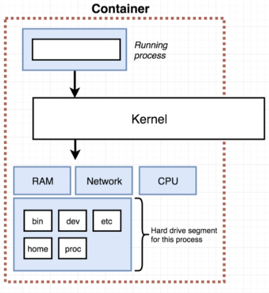
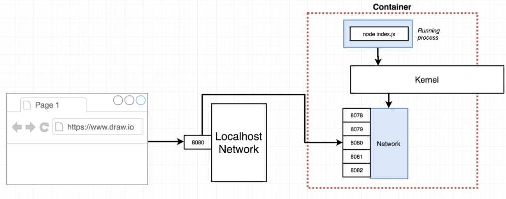
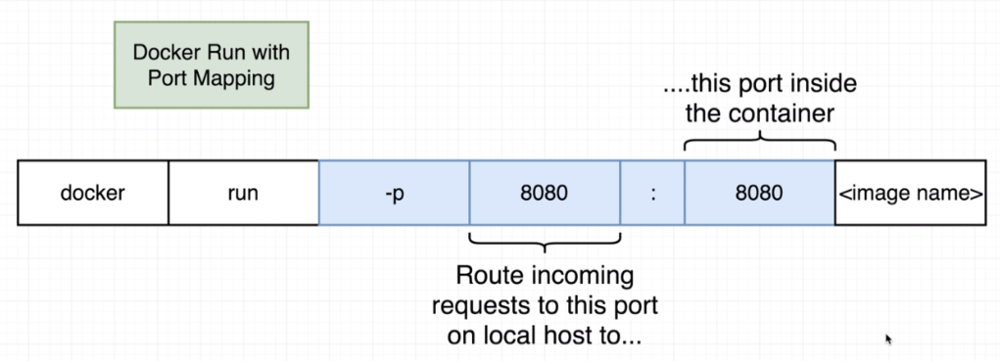

# Dockerfile for simple node project

We intended to make a simple node project and run it on a docker container. So we created a package.json and a index.js that would be executed inside the container. The problem is the Dockerfile:

## Dockerfile

The commands to run the project is:

```
docker build -t rafaelito/simpleweb .

docker run -p 8080:8080 rafaelito/simpleweb

docker exec -it <id_container> sh
```

The final version of the docker file is:

```
FROM node:alpine

WORKDIR /usr/app

COPY ./package.json ./
RUN npm install
COPY ./ ./

CMD ["npm", "start"]
```

but to know how it came to be what it is (step by step), you need to keep reading this document

---


## First version - Base

```
FROM alpine

RUN npm install

CMD ["npm", "start"]
```

It fails, because the alpine base image doesn't have npm installled.

## Second version - Node base image

```
FROM node:alpine

RUN npm install

CMD ["npm", "start"]
```

And it almost got there. But npm complained our project didn't have the package.json file. And that's because the files that are "docker build ." are not automatically visible inside the container. There is a command to make it work work work (dararirara dãr dãr dãr)



As we can see. The container is started only with a base file system, which does not contain the files in your Dockerfile directory by default. They need to be added.

## Third version - File system

```
FROM node:alpine

# Transfer de files from the docker build running directory to the
# container's root
COPY ./ ./
RUN npm install

CMD ["npm", "start"]
```

The build will then work properly, but the files will be transfered to the root of the file system of the container. So to make things more manageble, let's send it to a specific directory with the **WORKDDIR** commmand

```
FROM node:alpine

#All the following commands will be executed on the workdir

WORKDIR /usr/app

COPY ./ ./
RUN npm install

CMD ["npm", "start"]
```

Now you can run

> docker build -it rafaelito/simpleweb .

> docker run rafaelito/simpleweb

Ok... so now the application works?
> NO!

It doesn't work because of the port mapping.

## Fourth version - Port mapping

The container and the operational system does not share the same ports, which means that the 8080 port of the container is totally detached from the the system 8080 port and that's why localhost:8080 still doesn't work.



So to create the bridge between the system and the container, the following command should be called:



So basically we had to run the container like

> docker build -t rafaelito91/simpleweb . (*The dot ('.') character at the end is important*)

> docker run -p 8080:8080 rafaelito91/simpleweb

To have access to the container terminal, you can also run:

> docker run -p 8080:8080 -lt rafaelito91/simpleweb sh

> docker exec -lt **container_id** sh

## Fifth version - Unnecessary Build 

If you do any modification on a controller or any other files, the whole build step will run again. The problem with it is that node doesn't require the build step to be executed unless package.json was modified. So, in order to work around that we can separate the copy of package.json from the other files.


```
FROM node:alpine

WORKDIR /usr/app

COPY ./package.json ./
RUN npm install
COPY ./ ./

CMD ["npm", "start"]

```

In this new version, the build step will not be executed again